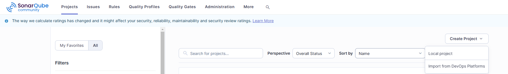

# Implemetación de plugin multibranch en SonarQube

## Implementación en el chart

Para añadir el plugin al chart de SonarQube debemos añadir al archivo values.yml con el que despleguemos el siguiente fragmento.

```yaml
plugins:
  install:
    - https://github.com/mc1arke/sonarqube-community-branch-plugin/releases/download/1.23.0/sonarqube-community-branch-plugin-1.23.0.jar
sonarProperties:
  sonar.web.javaAdditionalOpts: "-javaagent:/opt/sonarqube/extensions/plugins/sonarqube-community-branch-plugin-1.23.0.jar=web"
  sonar.ce.javaAdditionalOpts: "-javaagent:/opt/sonarqube/extensions/plugins/sonarqube-community-branch-plugin-1.23.0.jar=ce"
```

Siendo el `1.23.0` la versión del plugin siguiendo esta rúbrica:

|  SonarQube Image  |                |
|      Version      | Plugin Version |
|-------------------|----------------|
| 24.12 (10.8)      | 1.23.0         |
| 10.6 - 10.7       | 1.22.0         |
| 10.5              | 1.20.0         |
| 10.4              | 1.19.0         |
| 9.9 (LTS)         | 1.14.0         |

## Implementación del plugin dentro de SonarQube

Para usar el plugin crearemos un proyecto en la pestaña de `Projects` en el desplegable `Create Project/Local project`

